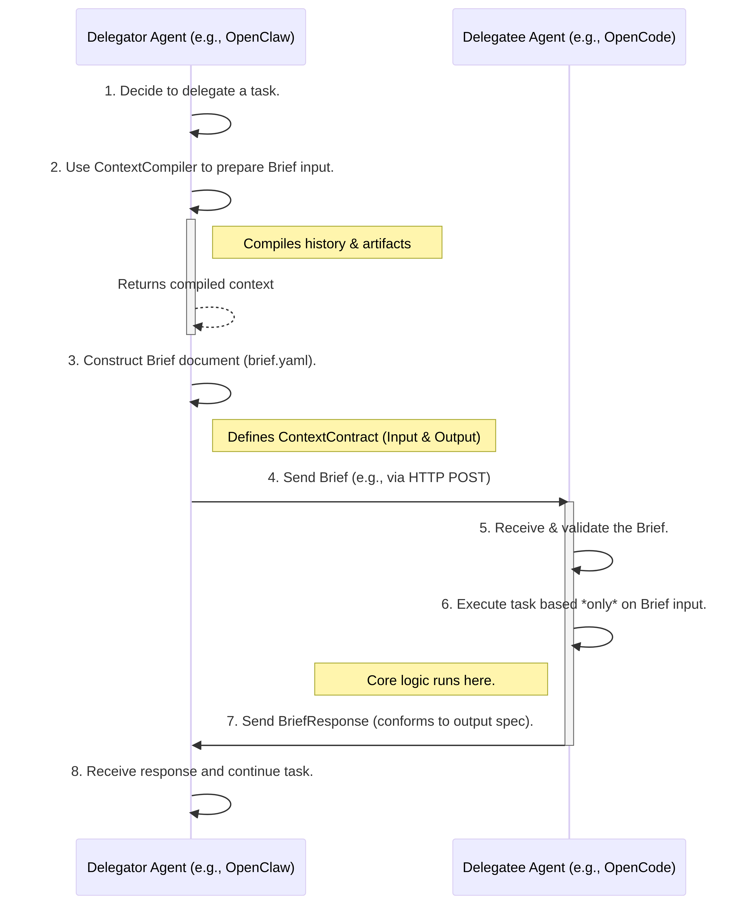

# Brief: A Protocol for Explicit Agent Delegation

**Author**: Manus AI
**Version**: 1.2
**Date**: 2026-02-06

## 1. Introduction: The Case for Explicit Delegation

The discourse surrounding multi-agent AI systems is currently at a crossroads. On one side, frameworks like CrewAI and AutoGen champion the power of collaborative agent ensembles. On the other, influential voices, notably the Cognition team behind Devin, have raised significant concerns, arguing that most multi-agent architectures are fundamentally flawed due to **implicit handoffs** [1].

> An **implicit handoff** occurs when one agent passes a task to another without a clearly defined, structured, and complete context. It is the programmatic equivalent of a manager telling an employee, "Just handle this," without providing the necessary background, goals, and constraints. This ambiguity leads to a cascade of problems, including decision conflicts, context loss, and fragile, unpredictable systems.

**Brief** is a new protocol and lightweight SDK built on the opposite principle: **Explicit Delegation**.

We concur with the diagnosis of the problem but propose a more nuanced solution. Rather than abandoning the potential of multi-agent systems, we should formalize the process of inter-agent delegation. Brief introduces a standardized, auditable protocol that transforms the chaotic "implicit handoff" into a formal "explicit delegation." It provides the structure for one agent to issue a task to another, much like a well-written JIRA ticket, a formal Request for Proposal (RFP), or a military briefing.

This approach allows developers to harness the best of both worlds: the focused power of specialized agents and the scalable coordination of a multi-agent system, all without the associated chaos. It is designed for advanced agent developers and enterprise architects who are grappling with the challenges of "context pollution" and uncontrollable agent collaboration.

## 2. Core Principles & Innovations

To be truly innovative and solve real pain points, Brief is built on three core principles:

1.  **Simplicity First**: The protocol must be simpler to use than writing an ad-hoc script. If creating a `Brief` is harder than making a direct API call, it has failed. This means minimal required fields and a human-friendly format.
2.  **Opaque & Stateless Execution**: The delegatee agent is a black box. It MUST operate *only* on the context provided in the `Brief`. It cannot access the delegator's internal state, memory, or full history. This enforces a strong decision boundary and prevents context pollution.
3.  **Embrace, Don't Replace**: Brief is not another all-encompassing framework. It is a lightweight semantic layer designed to work *with* existing standards like A2A and MCP, not replace them.

## 3. The Brief Protocol: A Two-Document System

Brief consists of two simple Markdown documents: the `.brief.md` (the request) and the `.response.md` (the result).

### 3.1. The Request: `[id].brief.md`

This document is the formal "task order." It follows the `SKILL.md` paradigm of YAML frontmatter for metadata and a Markdown body for human-readable instructions.

**Example `brief-a4b1c8.brief.md`:**

```markdown
---
id: "brief-a4b1c8"
protocolVersion: "1.2.0"
delegator: "agent-openclaw-prod"
delegatee: "capability:code-refactoring"
timestamp: "2026-02-06T03:55:00Z"
---

# Briefing: Refactor Authentication Module to SSO

## 1. Objective

Refactor the primary user authentication module to delegate authentication to our new internal SSO service.

## 2. Context & History

*User initially reported slow login times. Internal analysis confirmed a database bottleneck in the legacy `users` table during password verification. The architectural decision was made to migrate to the centralized SSO service to improve performance and security.*

## 3. Key Constraints

- **Backward Compatibility**: The existing v1 API endpoints (`/auth/login`) MUST remain functional.
- **Code Standards**: All new code MUST adhere to the project's 'strict-ts' linting rules.

## 4. Required Artifacts

- **Current Module Source**: `file:///home/ubuntu/project/src/auth`
- **SSO Service Documentation**: `https://internal.docs/sso/v2/api`

## 5. Expected Deliverables

1.  **Refactored Code**: The complete, tested source code for the new authentication module.
2.  **Pull Request**: A GitHub Pull Request containing the changes, ready for review.
```

### 3.2. The Response: `[id].response.md`

To complete the loop, the delegatee agent sends back a response document. This ensures the entire delegation is a self-contained, auditable record.

**Example `brief-a4b1c8.response.md`:**

```markdown
---
id: "brief-a4b1c8"
status: "success"
timestamp: "2026-02-06T04:30:00Z"
---

# Response: Refactoring Complete

## 1. Summary

The authentication module has been successfully refactored to use the SSO service. All tests passed.

## 2. Delivered Artifacts

- **Pull Request**: https://github.com/example/project/pull/123

## 3. Notes

- A compatibility layer was added to `src/auth/compat.ts` to support the v1 API.
- Please ensure the `SSO_CLIENT_SECRET` environment variable is set in production.
```

## 4. The Cascading Trace: `trace.md`

To handle true multi-level, cascading delegation (A → B → C), the `trace` is not part of the `Brief` itself. Instead, it's a separate, append-only log that travels with the task, providing a complete, chronological audit trail.

**Example `trace.md`:**

```markdown
- **Agent**: `agent-root` @ `2026-02-06T03:50:00Z`
  - **Action**: Received user request: "Fix the slow login."
- **Agent**: `agent-openclaw-prod` @ `2026-02-06T03:55:00Z`
  - **Action**: Delegating refactoring task. Created `brief-a4b1c8.brief.md`.
- **Agent**: `agent-opencode-v4` @ `2026-02-06T04:05:00Z`
  - **Action**: Accepted `brief-a4b1c8`. Task is complex, delegating documentation update. Created `brief-c9d2e7.brief.md`.
- **Agent**: `agent-docs-writer` @ `2026-02-06T04:15:00Z`
  - **Action**: Accepted `brief-c9d2e7`. Completed documentation update. Responded with `brief-c9d2e7.response.md`.
- **Agent**: `agent-opencode-v4` @ `2026-02-06T04:30:00Z`
  - **Action**: Received response for `brief-c9d2e7`. Completed refactoring. Responded with `brief-a4b1c8.response.md`.
```

This separation is critical: the `Brief` is the *what*, and the `trace` is the *who* and *when*. It keeps the `Brief` clean and focused on the task at hand.

## 5. Ecosystem Integration & Flow

Brief is designed to be a semantic layer that sits on top of existing transport and discovery protocols. It does not reinvent the wheel.



1.  **Discovery (A2A)**: Agent A (Delegator) needs a `code-refactoring` capability. It uses the A2A protocol to query an Agent Directory and discovers Agent B, whose `AgentCard` lists this capability and support for the `brief-protocol-v1.2`.

2.  **Delegation (Brief over A2A)**: Agent A creates a `.brief.md` document. It then uses the A2A `SendMessage` operation to send this document to Agent B. The `Brief` content is the payload of the A2A message.

3.  **Execution (Opaque)**: Agent B receives the `Brief`. It executes the task using its own internal logic and tools. If it needs to call a specific tool (e.g., a code linter), it might use the **MCP (Model-Context-Protocol)** to interact with that tool.

4.  **Cascading Delegation (Brief over A2A, again)**: If Agent B decides it needs to delegate a sub-task (e.g., updating documentation), it becomes a delegator itself. It creates a *new* `.brief.md` and sends it to Agent C, appending its action to the `trace.md` file.

5.  **Response (Brief over A2A)**: Once Agent B completes the original task, it creates a `.response.md` document and sends it back to Agent A, again using the A2A protocol.

This layered approach is the key to Brief's simplicity and power. It provides the missing "what" (the `Brief` format) without interfering with the established "how" (A2A for transport, MCP for tools).

## 6. SDK Design (`brief-sdk` for TypeScript)

The SDK's primary role is to make creating, parsing, and validating these Markdown documents trivial.

```typescript
import { Brief, BriefResponse, BriefFactory } from 'brief-sdk';

// --- Delegator Side ---

// 1. Create a Brief
const brief = BriefFactory.create({
  delegator: 'agent-openclaw-prod',
  delegatee: 'capability:code-refactoring',
  body: '# Briefing: Refactor Auth\n\n## 1. Objective...'
});

// brief.content is now a fully formatted .brief.md string
// 2. Send it via A2A client (or any transport)
a2aClient.sendMessage(brief.delegatee, brief.content);

// --- Delegatee Side ---

// 3. Receive and parse the Brief
const receivedContent = a2aMessage.parts[0].text;
const incomingBrief = Brief.parse(receivedContent);

// 4. Execute the task (your agent's core logic)
const results = await myAgent.doWork(incomingBrief);

// 5. Create a response
const response = incomingBrief.createResponse({
  status: 'success',
  body: `# Response: Refactoring Complete\n\n- **Pull Request**: ${results.prUrl}`
});

// 6. Send the response back
a2aClient.sendMessage(response.delegator, response.content);
```

Notice the `ContextCompiler` is gone. It's a useful utility, but not a core part of the protocol. It can be provided as an optional helper function in the SDK later.

## 7. Conclusion: Simple, Real, and Innovative

This revised design for Brief is:

-   **Simple**: It's just two Markdown files and an optional trace log. Anyone who can write Markdown can use it.
-   **Innovative**: It introduces the `.brief.md` / `.response.md` pattern and the decoupled `trace.md` for true, auditable cascading delegation.
-   **Real**: It solves the genuine pain point of chaotic agent handoffs by enforcing a clean, explicit contract, and it integrates with existing standards instead of competing with them.

This is a design that can "one-up" the competition not by being more complex, but by being radically simpler and more focused on the actual developer experience.

---

## References

[1] Cognition. (2025, June 12). *Don’t Build Multi-Agents*. [https://cognition.ai/blog/dont-build-multi-agents](https://cognition.ai/blog/dont-build-multi-agents)

## 8. Advanced Topic: Cascading Delegation & Fan-Out

While the simple A→B delegation is the most common use case, Brief is designed to handle complex, multi-level delegation chains (A→B→C) and fan-out/fan-in patterns (A delegates to B and C, then waits for both to respond).

### 8.1. Enabling Cascading: The `parentId` Field

To create a link between a parent `Brief` and a child `Brief`, we introduce an optional `parentId` field in the frontmatter.

- A `Brief` with no `parentId` is a **root brief**.
- A `Brief` *with* a `parentId` is a **sub-brief**.

When Agent B, while executing `brief-a4b1c8`, decides to delegate a sub-task to Agent C, it creates a new brief (`brief-c9d2e7`) and sets the `parentId`:

```yaml
# In brief-c9d2e7.brief.md
---
id: "brief-c9d2e7"
parentId: "brief-a4b1c8" # <-- This links it to the parent task
protocolVersion: "1.2.0"
delegator: "agent-opencode-v4"
delegatee: "agent-docs-writer"
timestamp: "2026-02-06T04:05:00Z"
---
# Briefing: Update Developer Docs for SSO Refactor
...
```

This simple mechanism allows for the construction of a complete task tree, which is essential for tracing and debugging.

### 8.2. The `trace.md` in a Cascading World

The `trace.md` file is the key to maintaining a coherent audit trail across multiple levels. The rules are simple:

1.  **Pass it Down**: When an agent creates a sub-brief, it MUST pass a copy of its current `trace.md` along with the new `.brief.md` to the sub-agent.
2.  **Append, Don't Replace**: The sub-agent appends its own actions to the `trace.md` it received.
3.  **Return it Up**: When the sub-agent sends its `.response.md`, it MUST also return the updated `trace.md`.
4.  **Merge**: The parent agent is responsible for merging the trace from the sub-task back into its main trace. For simple A→B→C chains, this is a simple append. For fan-out scenarios, the parent must handle parallel trace branches.

### 8.3. Fan-Out and Fan-In Pattern

Brief supports scenarios where one agent delegates tasks to multiple other agents in parallel and waits for all of them to complete.

Imagine Agent A needs to get a stock price (`brief-002` to Agent B) and a news sentiment analysis (`brief-003` to Agent C) to make a decision.

1.  Agent A creates two separate briefs, both with the same `parentId` (e.g., the ID of the root user request).
2.  Agent A sends `brief-002` to B and `brief-003` to C.
3.  Agent A now waits until it has received both `.response.md` files for `brief-002` and `brief-003`.
4.  Once both responses are received, Agent A can synthesize the results and complete its original task.

The SDK can provide helper utilities to manage this fan-out/fan-in logic, such as a `waitForAll(briefIds)` function.

### 8.4. Depth Limiting: Preventing Infinite Recursion

To prevent runaway costs or infinite delegation loops, a `maxDepth` can be set in the root brief's frontmatter. Each level of delegation increments a `currentDepth` counter. If `currentDepth` exceeds `maxDepth`, the agent is forbidden from creating further sub-briefs.

These advanced features are designed to be **progressively disclosed**. For simple tasks, you only need to think about two Markdown files. For complex orchestrations, the `parentId` and `trace.md` provide the necessary power and control.
